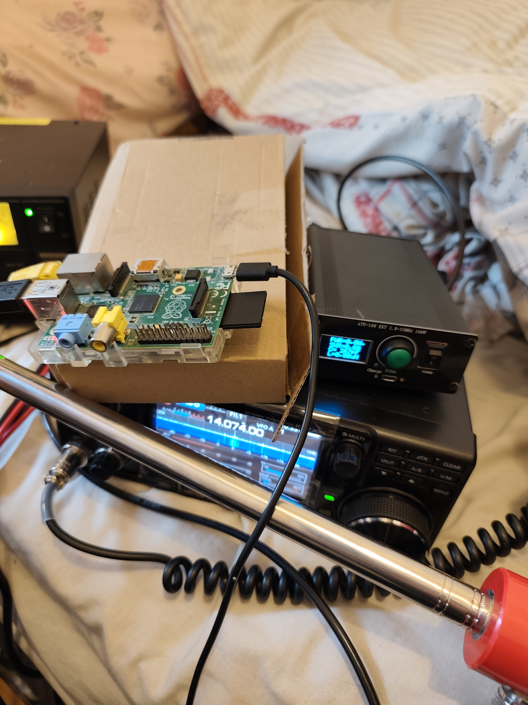
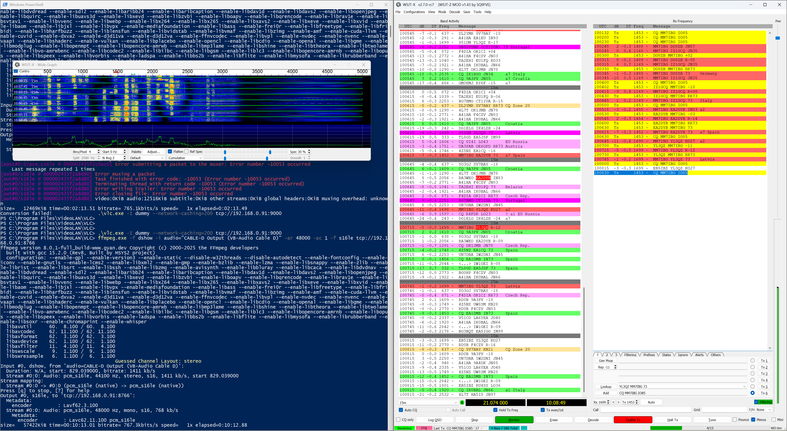

# 73overip 📻

**IC-7300 Remote Audio Control over IP**  
*By MM7IBG — GPL v3*

A remote HF station controller for the Icom IC-7300 via a Raspberry Pi, streaming bidirectional audio over TCP so you can run WSJT-X (or any digital mode software) from anywhere on your network.
All the solutins for linux did look really good but this is a 14 year old computer. This would be like using a 286 in the year 2000, and this is streaming audio over TCP not running lotus spreadsheets. And linux was either too new and slow or too old and had hamlib with no icom 7300 support.
So FREEBSD-13.5-RELEASE-armv6 to the rescue!
I wanted it to be completely headless, no X11 no vnc required.
> ⚠️ **Pre-Alpha Software** — This project is in early development. The Python control script in particular is rough around the edges and may not work reliably. It was more of a proof of concept that got the job done. Use at your own risk, pull requests welcome, and don't blame me if your on a UK foundation license and your radio keys up on 60m. Or what's slightly less serious is that you mess up your inputs and outputs in wsjtx and end up transmitting a three six mafia album on 20m ft8 frequency which is somethign that could theoretically happen 73!

---

## The Station


> *The setup — IC-7300 with an ATU-100 EXT automatic antenna tuner sitting on top. Running 17W on 20m FT8. The waveform looks nice and clean on the IC-7300 display, and 17 watts is roughly about what I get with this radio and antenna setup.*

The ATU-100 reads:
- **PWR: 17W**
- **SWR: 1.18**
- **EFF: 99%**

Clean as a whistle.

---

## The Pi



> *The brain of the operation — a Raspberry Pi Model B running FreeBSD 13.5, sitting on a cardboard box as nature intended. Connected to the IC-7300 via USB for both audio and CAT control. Does the job beautifully despite being over a decade old.*

---

## It Works!


> *WSJT-X decoding 20m FT8 in real time, audio streamed live from the Pi to the Windows PC over TCP. The waterfall looks absolutely gorgeous — tight, clean signals with no artefacts from the streaming pipeline. VLC handles the RX stream on port 9000, ffmpeg pushes TX audio back to the Pi on port 8766. Stations across Europe decoding perfectly including Germany, Austria, Switzerland and Greece.*

---

## 15 Metres Goes Wild



> *That's me — MM7IBG — getting absolutely stuck into 15 metres at 21.074 MHz FT8. The band was wide open and the QSO list on the right is just filling up. Contacts coming in from Latvia, Italy, Spain, Croatia, Czech Republic, Belarus, Russia and more. This is the whole point of the project — remote HF operating from your desk with a proper station on the other end of a TCP connection and a Raspberry Pi older than most of WSJT-X's git history.*

---

## How It Works

```
Windows PC                          Raspberry Pi B          IC-7300
──────────────────────────────────────────────────────────────────
WSJT-X → CABLE-D Input              
ffmpeg ← CABLE-D Output ──TCP:8766──► nc | sox | virtual_oss ──► USB Audio
VLC → CABLE Input       ◄─TCP:9000── sox | virtual_oss        ◄── USB Audio
WSJT-X ← CABLE Output                                         rigctld:4532
radio_control.py ──────SSH──────────► rigctld / 73overip.sh
```

Audio is raw 48kHz 16-bit PCM over TCP. RX is delivered as WAV so VLC can play it directly with no codec overhead. Latency is minimal on a local network.

---

## Features

- **Python GUI** — tkinter-based control panel for starting/stopping streams and Pi services over SSH
- **Shell script** — `73overip.sh` handles all audio routing and streaming on the Pi side
- **SSH process control** — start/stop rigctld and the audio script on the Pi from the GUI
- **Settings persistence** — saved to `radio_config.json`

---

## Requirements

### Windows PC
- Windows 10/11 64-bit
- [Python 3.x](https://python.org/) — for the control GUI
- [VLC](https://www.videolan.org/) — RX audio playback
- [ffmpeg](https://ffmpeg.org/) — TX audio capture
- [VB-Audio Virtual Cable](https://vb-audio.com/Cable/) — CABLE for RX
- [VB-Audio Cable D](https://vb-audio.com/Cable/) — CABLE-D for TX
- WSJT-X (or any digital mode software)

### Raspberry Pi (FreeBSD)
```sh
pkg install hamlib sox virtual_oss ffmpeg netcat bash
```

---

## FreeBSD — Full Setup From Scratch

This covers everything needed on a brand new FreeBSD system to get 73overip running with an IC-7300.

### 1. Kernel Modules

The IC-7300 needs a kernel driver for USB audio.

```sh
# Load immediately
kldload snd_uaudio

# Verify it loaded
kldstat | grep uaudio
```

To make it load automatically on every boot, add to `/boot/loader.conf`:

```sh
snd_uaudio_load="YES"
snd_driver_load="YES"
```

### 2. Install Dependencies

```sh
pkg install hamlib sox virtual_oss ffmpeg netcat bash
```

| Package | License | Purpose |
|---|---|---|
| [hamlib](https://hamlib.github.io/) | LGPL v2.1 | Provides `rigctld` and `rigctl` for CAT control of the IC-7300 |
| [sox](http://sox.sourceforge.net/) | GPL v2 | Audio format conversion and streaming between virtual_oss and the network |
| [virtual_oss](https://github.com/hselasky/virtual_oss) | BSD 2-Clause | Creates a virtual OSS audio device (`/dev/vdsp.0`) that multiplexes the IC-7300 USB audio |
| [ffmpeg](https://ffmpeg.org/) | LGPL v2.1 | Audio capture and streaming (used on Windows side) |
| [netcat](https://netcat.sourceforge.net/) | BSD | TCP pipe for audio streaming between Pi and Windows |

### 3. Verify Devices Appeared

After plugging in the IC-7300 via USB and loading the modules:

```sh
# Check audio devices — IC-7300 should appear as dsp1 (or dsp0 if no onboard audio)
cat /dev/sndstat

# Check serial device for CAT control
ls /dev/cua*
# Should show /dev/cuaU0
```

If the IC-7300 audio ends up on a different device (e.g. `/dev/dsp0`), adjust the `DSP=` line in `73overip.sh` accordingly.

### 4. Configure virtual_oss

`virtual_oss` sits between the physical IC-7300 USB audio device and the rest of the software. It creates a virtual device (`/dev/vdsp.0`) that both sox (for RX) and sox (for TX) can read/write simultaneously — without it you can only have one process accessing the audio device at a time.

The command used in `73overip.sh`:

```sh
virtual_oss -C 2 -c 2 -r 48000 -b 16 -s 4ms -f /dev/dsp1 -m 0,0,1,1 -d vdsp.0
```

Breaking down each flag:

| Flag | Value | Meaning |
|---|---|---|
| `-C 2` | 2 | Number of channels on the **output** (playback to radio) |
| `-c 2` | 2 | Number of channels on the **input** (record from radio) |
| `-r 48000` | 48000 | Sample rate in Hz — IC-7300 USB audio runs at 48kHz |
| `-b 16` | 16 | Bit depth — 16-bit PCM |
| `-s 4ms` | 4ms | Buffer size — lower = less latency, too low = audio glitches |
| `-f /dev/dsp1` | /dev/dsp1 | The **physical** OSS device (IC-7300 USB audio) |
| `-m 0,0,1,1` | — | Channel mapping: maps physical channels to virtual channels |
| `-d vdsp.0` | vdsp.0 | Name of the virtual device to create — becomes `/dev/vdsp.0` |

After `virtual_oss` starts, `/dev/vdsp.0` appears and both the RX and TX sox processes in `73overip.sh` use that virtual device instead of `/dev/dsp1` directly.

### 5. Set Mixer Levels

**This is critical** — FreeBSD defaults mixer levels to 75% which will give you only ~3W output on the IC-7300 instead of full power:

```sh
mixer vol 100:100
mixer pcm 100:100
```

Verify:
```sh
mixer
# Should show vol and pcm both at 100:100
```

These are already included in `73overip.sh` but if you want them persistent across reboots add to `/etc/rc.local`:

```sh
mixer vol 100:100
mixer pcm 100:100
```

### 6. Serial Port Access

Add your user to the `dialer` group so rigctld can access `/dev/cuaU0` without needing sudo:

```sh
pw groupmod dialer -m freebsd
# Log out and back in for group change to take effect
```

Verify:
```sh
groups freebsd
# Should include "dialer"
```

### 7. Test rigctld Manually

Before running the full script, test CAT control works:

```sh
# Start rigctld manually
rigctld -m 3073 -s 9600 -r /dev/cuaU0 &

# In another terminal, test it
rigctl -m 2 -r localhost:4532 f
# Should return the current frequency e.g. 14074000

rigctl -m 2 -r localhost:4532 get_mode
# Should return USB-D 3000

# Kill it when done
killall rigctld
```

Model number `3073` is the IC-7300. If it can't open the serial port check the device name and group membership.

### 8. Test Audio Manually

```sh
# Start virtual_oss
virtual_oss -C 2 -c 2 -r 48000 -b 16 -s 4ms -f /dev/dsp1 -m 0,0,1,1 -d vdsp.0 &
sleep 2

# Record a few seconds from the IC-7300
sox -t oss /dev/vdsp.0 -r 48000 -c 2 -b 16 -e signed-integer test.wav trim 0 5

# Play it back I'd suggest on windows tenacity 
play test.wav

# Clean up
killall virtual_oss
```

If `test.wav` contains audio from the radio the audio chain is working correctly.

---

## Pi Setup (`73overip.sh`)

```sh
#!/bin/sh
DSP=/dev/dsp1
VDSP=/dev/vdsp.0
RATE=48000

echo "starting rigctld"

rigctld -m 3073 -s 9600 -r /dev/cuaU0 &


echo "Starting virtual_oss mixer..."
virtual_oss -C 2 -c 2 -r $RATE -b 16 -s 4ms -f $DSP -m 0,0,1,1 -d vdsp.0 &
VOSS_PID=$!
sleep 2
mixer vol 100:100
mixer pcm 100:100
if [ ! -e $VDSP ]; then
  echo "ERROR: $VDSP did not get created"
  exit 1
fi

echo "virtual_oss started, $VDSP is ready"

echo "Starting RX stream on port 9000..."
while true; do
  sox -t oss $VDSP -r $RATE -c 2 -b 16 -e signed-integer -t wav - | nc -l 9000
  echo "RX client disconnected, restarting..."
  sleep 1
done &
RX_PID=$!

echo "Starting TX stream on port 8766..."
while true; do
  nc -l 8766 | play -q --buffer 1024 -t raw -r $RATE -c 1 -b 16 -e signed-integer  - -v 15.0  -t oss $VDSP
  echo "TX client disconnected, restarting..."
  sleep 1
done &
TX_PID=$!

echo "Audio streaming started."
echo "virtual_oss PID=$VOSS_PID"
echo "RX PID=$RX_PID  TX PID=$TX_PID"
wait

```
I usually just run it as root which probably isn't that big of a security issue. If you wanted to just straight up disable internet on the PI and run it lan only. Or you could expose some ports and have it be trully portable. As in leave the radio and pi in a high place with electricity and control from home.
**Key settings:**
- `vol 15.0` on the TX chain gets the IC-7300 to full output power in USB-D mode
- `mixer vol 100:100` and `mixer pcm 100:100` are essential — leaving these at 75% will give you only ~3W output
- In USB-D mode the ALC is bypassed by design — monitor the power meter instead
- `rigctld` runs on the Pi and is accessed remotely via SSH from the control scripts

---


---

## IC-7300 Settings

| Setting | Value |
|---|---|
| Mode | USB-D (for FT8/digital) |
| Menu → Connectors → DATA MOD | USB |
| Menu → Connectors → USB MOD Level | 50%-60% mines on 60% I'll probably turn it to like 55 |
| Menu → SWR |

---

## License

Copyright (C) 2025 MM7IBG

This program is free software: you can redistribute it and/or modify it under the terms of the GNU General Public License as published by the Free Software Foundation, either version 3 of the License, or (at your option) any later version.

### Dependency Licenses

| Component | License | Link |
|---|---|---|
| [hamlib / rigctld](https://hamlib.github.io/) | LGPL v2.1 | Radio CAT control |
| [SoX](http://sox.sourceforge.net/) | GPL v2 | Audio processing |
| [virtual_oss](https://github.com/hselasky/virtual_oss) | BSD 2-Clause | Virtual OSS audio multiplexer |
| [ffmpeg](https://ffmpeg.org/) | LGPL v2.1 | Audio streaming |
| [VLC](https://www.videolan.org/) | GPL v2 | RX audio playback (Windows) |
| [VB-Audio Virtual Cable](https://vb-audio.com/Cable/) | Freeware | Windows audio routing |
| [WSJT-X](https://wsjt.sourceforge.io/) | GPL v3 | Digital mode software |

---

*73 de MM7IBG* 🗼
