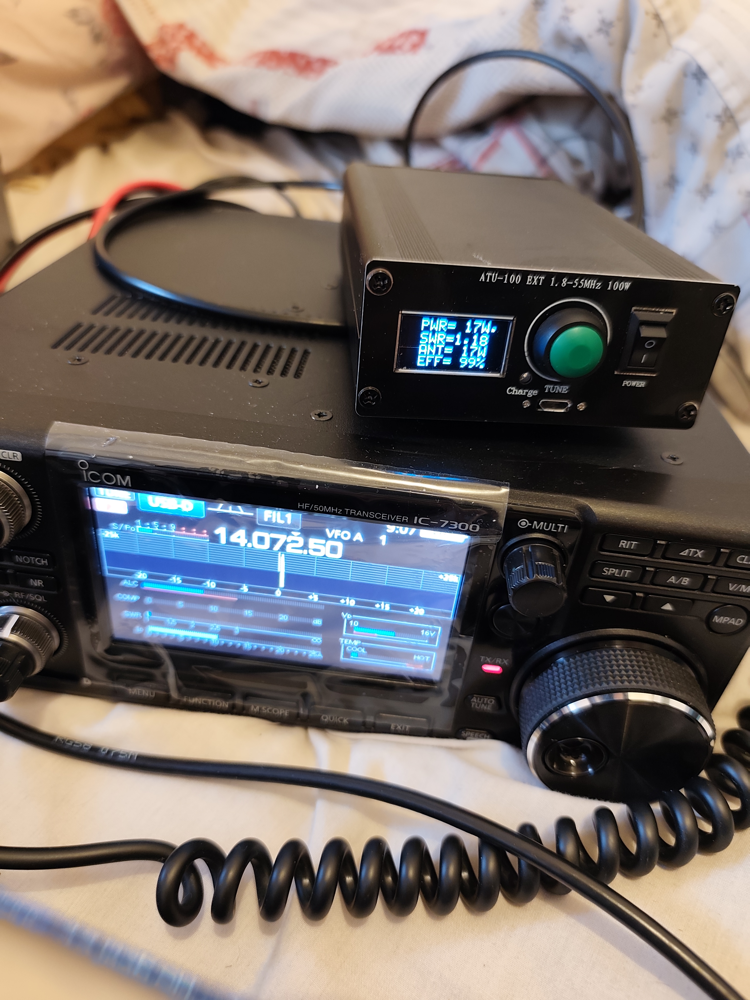

# 73overip 📻

**IC-7300 Remote Audio Control over IP**  
*By MM7IBG — GPL v3*

A remote HF station controller for the Icom IC-7300 via a Raspberry Pi, streaming bidirectional audio over TCP so you can run WSJT-X (or any digital mode software) from anywhere on your network. Built with Dear ImGui + DirectX11 (Windows) or SDL2 + OpenGL3 (cross-platform).

---

## The Station



> *The setup — IC-7300 with an ATU-100 EXT automatic antenna tuner sitting on top. Running 17W on 20m FT8. The waveform looks nice and clean on the IC-7300 display, and 17 watts is roughly about what I get with this radio and antenna setup.*

The ATU-100 reads:
- **PWR: 17W**
- **SWR: 1.18**
- **EFF: 99%**

Clean as a whistle. 

---

## It Works!


> *WSJT-X decoding 20m FT8 in real time, audio streamed live from the Pi to the Windows PC over TCP. The waterfall looks absolutely gorgeous — tight, clean signals with no artefacts from the streaming pipeline. VLC handles the RX stream on port 9000, ffmpeg pushes TX audio back to the Pi on port 8766. Stations across Europe decoding perfectly including Germany, Austria, Switzerland and Greece.*

---


## This is 15 meter band


---


## How It Works

```
Windows PC                          Raspberry Pi B          IC-7300
──────────────────────────────────────────────────────────────────
WSJT-X → CABLE-D Input              
ffmpeg ← CABLE-D Output ──TCP:8766──► nc | sox | virtual_oss ──► USB Audio
VLC → CABLE Input       ◄─TCP:9000── sox | virtual_oss        ◄── USB Audio
WSJT-X ← CABLE Output                                         rigctld:4532
73overip.exe ──────────SSH──────────► rigctld / 73overip.sh
```

Audio is raw 48kHz 16-bit PCM over TCP. RX is delivered as WAV so VLC can play it directly with no codec overhead. Latency is minimal on a local network.

---


## Requirements

### Windows PC
- Windows 10/11 64-bit
- [VLC](https://www.videolan.org/) — RX audio playback
- [ffmpeg](https://ffmpeg.org/) — TX audio capture
- [VB-Audio Virtual Cable](https://vb-audio.com/Cable/) — CABLE for RX
- [VB-Audio Cable D](https://vb-audio.com/Cable/) — CABLE-D for TX
- WSJT-X (or any digital mode software)

### Raspberry Pi (FreeBSD)
```sh
pkg install hamlib sox virtual_oss ffmpeg bash sudo nano
```


## Pi Setup (`73overip.sh`)

```bash
#!/bin/sh
DSP=/dev/dsp1
VDSP=/dev/vdsp.0
RATE=48000

echo "starting rigctld" 

rigctld -m 3073 -s 9600 -r /dev/cuaU0 &


echo "Starting virtual_oss mixer..."
virtual_oss -C 2 -c 2 -r $RATE -b 16 -s 4ms -f $DSP -m 0,0,1,1 -d vdsp.0 &
VOSS_PID=$!
sleep 2
mixer vol 100:100
mixer pcm 100:100
if [ ! -e $VDSP ]; then
  echo "ERROR: $VDSP did not get created"
  exit 1
fi

echo "virtual_oss started, $VDSP is ready"

echo "Starting RX stream on port 9000..."
while true; do
  sox -t oss $VDSP -r $RATE -c 2 -b 16 -e signed-integer -t wav - | nc -l 9000
  echo "RX client disconnected, restarting..."
  sleep 1
done &
RX_PID=$!

echo "Starting TX stream on port 8766..."
while true; do
  nc -l 8766 | play -q --buffer 1024 -t raw -r $RATE -c 1 -b 16 -e signed-integer  - -v 15.0  -t oss $VDSP
  echo "TX client disconnected, restarting..."
  sleep 1
done &
TX_PID=$!

echo "Audio streaming started."
echo "virtual_oss PID=$VOSS_PID"
echo "RX PID=$RX_PID  TX PID=$TX_PID"
wait

```

**Key settings:**
- `vol 15.0` on the TX chain gets the IC-7300 to full output power in USB-D mode
- `mixer vol 100:100` and `mixer pcm 100:100` are essential — leaving these at 75% will give you only ~3W output
- In USB-D mode the ALC is bypassed by design — monitor the power meter instead
- `rigctld` runs on the Pi and is accessed remotely via SSH tunnel from the GUI


## IC-7300 Settings

| Setting | Value |
|---|---|
| Mode | USB-D (for FT8/digital) |
| Menu → Connectors → DATA MOD | USB |
| Menu → Connectors → USB MOD Level | 50–80% mine is on 60% | 
| RF POWER | Set to desired output |
| Monitor | SWR |

---

## FreeBSD Dependency Install

```sh
pkg install hamlib sox virtual_oss ffmpeg
```

Check serial port:
```sh
ls /dev/cua*
# Usually /dev/cuaU0 for USB serial it's /dev/cuaU0 on FreeBSD-13.5-RELEASE-arm-armv6-RPI-B but might be different on STABLE, in fact I know it's different on stable.
```

Add user to dialer group for serial access without sudo but I usually run it as root to avoid horrific problems with 
```sh
pw groupmod dialer -m freebsd
```

---

## License

Copyright (C) 2025 MM7IBG

This program is free software: you can redistribute it and/or modify it under the terms of the GNU General Public License as published by the Free Software Foundation, either version 3 of the License, or (at your option) any later version.

**Dependencies:**
- [Dear ImGui](https://github.com/ocornut/imgui) — MIT License
- [nlohmann/json](https://github.com/nlohmann/json) — MIT License  
- [SDL2](https://libsdl.org/) — zlib License

---

*73 de MM7IBG* 🗼
